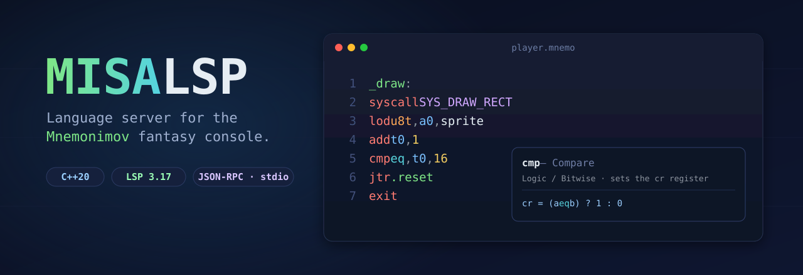

<div align="center">



<br/>

**A fast, dependency-light Language Server for [MISA / Mnemonimov](AI%20Reference.md) assembly — written in modern C++.**

<br/>

[](https://github.com/mariusvn/MISA-LSP/actions/workflows/ci.yml)
[](LICENSE.md)


[**Features**](#-features) · [**Quick start**](#-quick-start) · [**Editor setup**](#-editor-integration) · [**Architecture**](#-architecture) · [**Language**](#-language-at-a-glance)

</div>

---

## ✨ Features

Everything below works **today**, driven by a single static knowledge base of the full MISA instruction set.

| | Capability | What it does |
|:--:|:--|:--|
| 🩺 | **Diagnostics** | Unknown instructions, wrong arity, `int`/`float` literal mismatches, writes to read-only registers, undefined labels, missing `exit` in entry points |
| 💡 | **Hover** | Rich docs for every instruction, register (with ABI role), syscall (args & returns), type, condition and built-in symbol |
| ⌨️ | **Completion** | **Context-aware** — proposes types after `lod`/`ste`, conditions after `cmp`, `SYS_*` after `syscall`, registers in operand slots, never a wall of noise |
| 🧭 | **Go to definition** | Jump to any label or constant, qualified names included (`PRINTER.MAPPING`) |
| 🔎 | **Find references** | Every use of a label or constant across the file |
| 🗂️ | **Document symbols** | Outline with entry-points highlighted and locals nested under their scope |
| ✍️ | **Signature help** | Operand slots per instruction, argument-by-argument syscall hints |
| 📐 | **Folding** | Label scopes, `bmk`/`sbmk` sections, doc-comment blocks |

> 🛰️ Communicates over **JSON-RPC 2.0 / stdio** — drop it into any LSP-capable editor.

---

## 🚀 Quick start

```bash
# Configure & build (first run fetches nlohmann/json + Catch2)
cmake -B build -DCMAKE_BUILD_TYPE=Release
cmake --build build --config Release
```

The server binary lands at `build/misa-lsp` (`build/Release/misa-lsp.exe` on Windows).

<details>
<summary>📦 <b>Prerequisites</b></summary>

<br/>

- **CMake** ≥ 3.20
- A **C++20** compiler — MSVC 2022, GCC 12+, or Clang 15+
- Internet access on the first build (dependencies are fetched automatically)

</details>

<details>
<summary>🧪 <b>Run the test suite</b></summary>

<br/>

```bash
cmake -B build -DBUILD_TESTING=ON
cmake --build build
ctest --test-dir build --output-on-failure
```

</details>

<details>
<summary>🔍 <b>Lint a file from the command line</b></summary>

<br/>

A standalone linter ships alongside the server — handy for CI or a quick check:

```bash
build/misa-lint path/to/game.mnemo
# game.mnemo:12:5: error: Expected a type (i8t, u8t, …) but got 'u17t'.
# -- 1 diagnostic(s), 1 error(s)
```

</details>

---

## 🔌 Editor integration

<details open>
<summary><b>VS Code</b></summary>

<br/>

Register the language and launch the server from your extension:

```ts
import { LanguageClient, ServerOptions, TransportKind } from 'vscode-languageclient/node';

const serverOptions: ServerOptions = {
  command: '/path/to/misa-lsp',
  transport: TransportKind.stdio,
};

const client = new LanguageClient(
  'misa-lsp',
  'MISA Language Server',
  serverOptions,
  { documentSelector: [{ scheme: 'file', language: 'mnemonimov' }] },
);

client.start();
```

</details>

<details>
<summary><b>Neovim</b> (built-in LSP)</summary>

<br/>

```lua
vim.api.nvim_create_autocmd('FileType', {
  pattern = 'mnemonimov',
  callback = function()
    vim.lsp.start({ name = 'misa-lsp', cmd = { '/path/to/misa-lsp' } })
  end,
})
```

</details>

---

## 🏗️ Architecture

One document becomes one cached **`Compilation`** (AST + symbols + diagnostics), rebuilt on every change.
Every feature provider reads from that plus the static knowledge base.

```
                 ┌─────────── transport ───────────┐
   editor  ⇄     │  JSON-RPC 2.0 over stdio          │
                 └──────────────┬──────────────────┘
                                │
   text ──► Lexer ──► ExprParser (Pratt) ──► Parser ──► AST
                                                         │
                          SemanticAnalyzer (2 passes) ◄──┘     ┌──────────────┐
                                   │                            │ Knowledge    │
                                   ▼                            │ Base (static)│
                              Compilation  ◄───────────────────┤ instructions │
                          (AST · symbols · diagnostics)         │ regs · sys…  │
                                   │                            └──────────────┘
       ┌───────────────────────────┴───────────────────────────────┐
   Diagnostics · Hover · Completion · Definition · References ·
   DocumentSymbols · SignatureHelp · Folding
```

```text
src/
  transport/   JSON-RPC stdio framing
  protocol/    LSP types + serialization
  server/      lifecycle, dispatch, document store
  text/        TextDocument (UTF-16 position handling)
  kb/          Knowledge Base (instructions, registers, syscalls…)
  lang/        Lexer → ExprParser → Parser → AST → SemanticAnalyzer → Compilation
  features/    one file per LSP feature provider
test/          Catch2 unit tests   ·   tools/  standalone linter
examples/      hello.mnemo · game_skeleton.mnemo
```

📖 Full design notes live in [**PLAN.md**](PLAN.md).

---

## 📝 Language at a glance

```misa
## Move the player and bounce it off the screen edge.
def SPEED 2

player_x: emb i32t 160        # data label, inspectable in the debugger

_update:
    lod  i32t, t0, player_x   # load  (types: i8t/u8t/…/f32t)
    add  t0, SPEED            # compact form: t0 += SPEED
    cmp  gte, t0, SCREEN_WIDTH
    jtr  .wrap
    str  i32t, player_x, t0
    exit
.wrap:
    str  i32t, player_x, zr   # zr always reads 0
    exit
```

| | |
|:--|:--|
| **Files** | `.mnemo`, `.asm` |
| **Comments** | `#` line · `##` doc-comment |
| **Integers** | `42` · `0x2a` · `0b101010` · `0o52` · `10_000` |
| **Floats** | `3.14` (no scientific notation) |
| **Strict typing** | `add 1.0` ❌ (wants int) · `fadd 1` ❌ (wants float) |
| **Labels** | global `foo:` · local `.bar:` · reusable `@loop:` + `@loop-` / `@end+` |

---

## 🤝 Contributing

Issues and pull requests are welcome! Before opening a PR, make sure the build is clean and the tests
pass locally (`ctest --test-dir build --output-on-failure`). New language behaviour should come with a
matching unit test under [`test/`](test).

## 🧠 Development note

This project was built with the assistance of AI coding tools (Claude code). The architecture, code, and tests were
directed, reviewed, built, and validated by a human — including against real-world MISA programs.

## 📄 License

Released under the [**MIT License**](LICENSE.md).

<div align="center"><sub>Made for the Mnemonimov community · happy hacking 🎮</sub></div>
